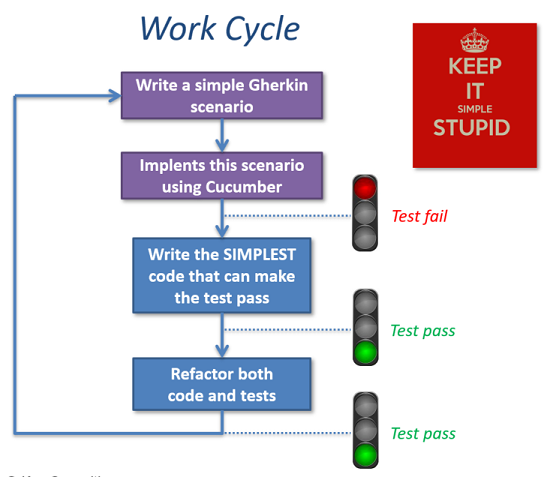

# cucumber-spreadsheet sample project
Behavior Driven Development (BDD) spreadsheet practice

This small **Java** project is a BDD practice support (for teaching purpose)
It uses [Cucumber](https://cucumber.io/) + [JUNit](https://junit.org/junit4/) to run [Gherkin](https://cucumber.io/docs/gherkin/reference/) scenarios and [Maven](https://maven.apache.org/) as build and dependencies management tool.

## Project context
We want to create a very **simple spreadsheet** system.
Including the followings features:
- A array with cells organized in columns and rows
- The spreadsheet cells can contains
    - Text (Feature 1)
    - Numbers (Feature 2)
    - Simple arithmetics formulas (Feature 3)
- If a cell contains a formula it can displays the formula **OR** the computed result
- The formulas can refer to others cell's content

## Purpose
We are about to describe our system's detailed expected behavior using **Gherkin** scenarios.
And then, implement these scenarios as unit tests with **Cucumber** to ensure our system runs with no bugs.

## Commands

Execute tests with

    > mvn test 

Generate pretty HTML report (in /target/cucumber-reports/)
 
    > mvn verify

## BDD rounds sequence for this practice
We are about to implement our 3 firsts Feature using classic TDD cycle.

- Round 1 : our 1st Feature is a basic spreadsheet cell with only text (Git tag = *round-1-start*)
- Round 2 : a 2nd Feature to improve our cell with numbers (Git tag = *round-2-start*)
- Round 3 : a 3rd Feature to introduce formulas (Git tag = *round-3-start*)
- Round 4 : improve our code with to limits tests and error cases (Git tag = *round-4-start*)
- Next steps : Checkout the *well-done* tag to go further

> If you are lost, you can follow the previous commits sequence to catch-up.
>
> Uses Git tags as shortcuts to reset your workspace ready for a new BDD round.

## Quick start
1. Git clone

        > git clone https://github.com/FDegrigny-44/cucumber-spreadsheet.git

2. fetch all the origin tags

        > get fetch --all --tags

3. Checkout the first tag to start

        > git checkout tags/round-1-start -b master

